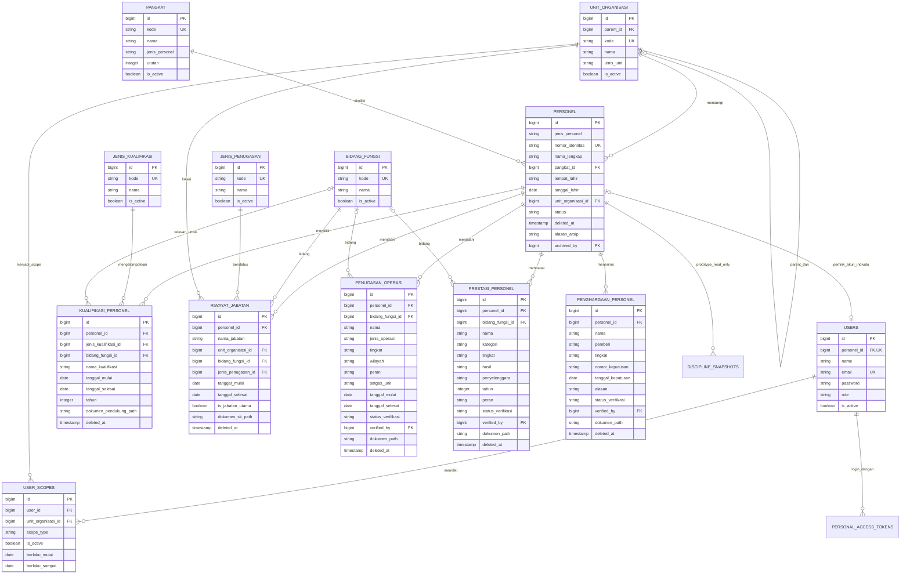
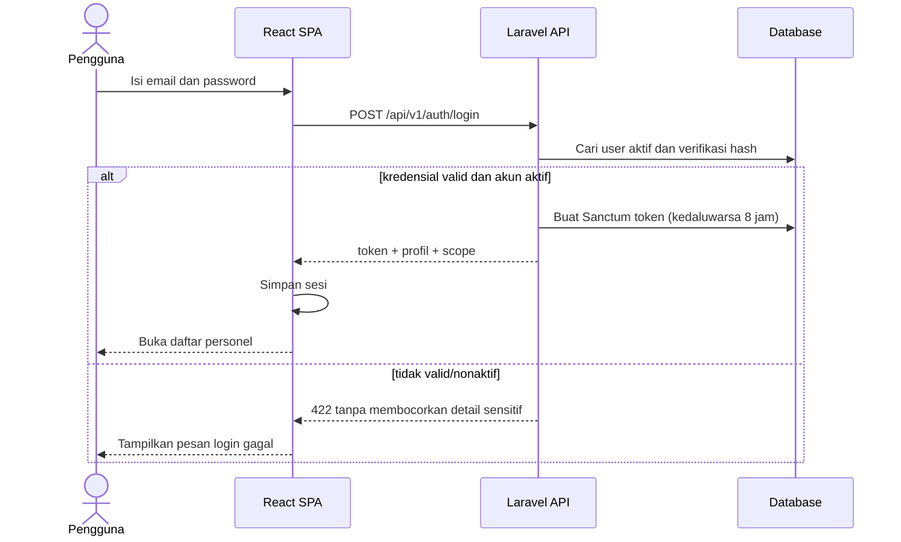
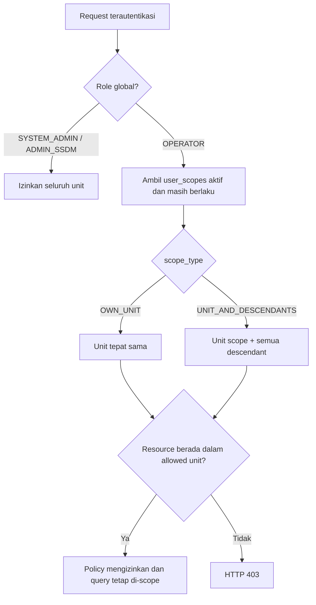
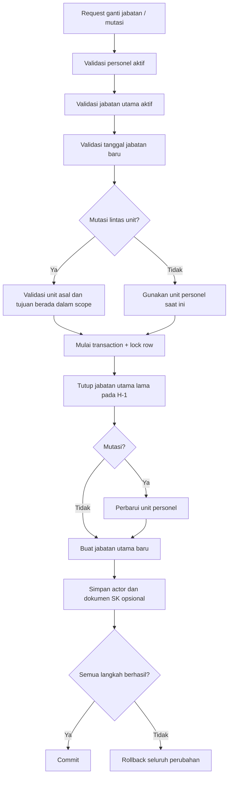
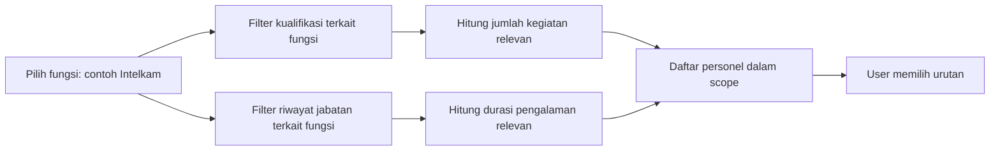

# Arsitektur dan Alur Utama

Dokumen ini merangkum struktur data serta alur keamanan dan mutasi pada Merit System Personel Polri. Diagram menggunakan Mermaid dan dapat dirender langsung oleh GitHub/GitLab.

## ERD domain utama

Catatan constraint penting:

- `nomor_identitas` unik dan tetap bertipe string agar nol di depan tidak hilang.
- Partial unique index menjamin hanya satu jabatan utama aktif per personel.
- Soft delete dipakai pada data domain agar penghapusan operasional tidak langsung menghilangkan histori.
- Path PDF tersimpan di database, sedangkan berkas berada pada storage privat.
- Penugasan operasi, prestasi, dan penghargaan masing-masing memiliki satu PDF opsional privat, status verifikasi, aktor, dan waktu verifikasi. Perubahan fakta membatalkan verifikasi sebelumnya.

## Alur authentication

Semua endpoint selain login wajib menggunakan `Authorization: Bearer <token>`. Middleware juga memastikan akun pemilik token masih aktif.

## Alur authorization dan scope organisasi

Scope diterapkan dua lapis: query hanya mengambil data yang boleh terlihat dan policy kembali memeriksa resource individual. Dengan demikian, mengganti ID pada URL tidak melewati authorization.

## Alur pergantian jabatan dan mutasi

Proses ini mencegah kondisi personel berpindah unit tetapi tidak mempunyai jabatan baru, atau mempunyai dua jabatan utama aktif akibat kegagalan di tengah proses.

## Alur pencarian kualifikasi

Jumlah kegiatan dan durasi pengalaman adalah ringkasan faktual, bukan skor otomatis. Keputusan merit tetap dilakukan pimpinan dengan membaca riwayat personel.

## Registrasi dan arsip

- Registrasi menerima pendidikan umum wajib, pendidikan Polri wajib untuk POLRI (opsional bagi PNS), serta riwayat awal opsional. Pendidikan tetap berupa record `kualifikasi_personel`, bukan kolom tunggal. Jenis pendidikan ditentukan server dari kode referensi.
- Identitas, jabatan awal, pendidikan, dan seluruh riwayat yang diisi disimpan dalam satu transaksi. Validasi menggunakan aturan domain yang sama dengan form profil. PDF tersimpan privat; kegagalan transaksi membersihkan file yang baru dibuat. Maksimal 20 record per jenis riwayat pada satu registrasi, PDF maksimal 5 MB per file.
- Riwayat jabatan saat registrasi harus sudah selesai; periode jabatan utama tidak boleh bertumpang tindih. Penempatan aktif diisi melalui jabatan utama awal.
- `users.personel_id` nullable dan unik. Akun Admin SSDM/Operator baru wajib terhubung ke personel aktif, nama akun berasal dari personel; programmer eksternal boleh tanpa personel. Pemilik akun yang telah terhubung tidak dapat dialihkan ke individu lain. Scope tetap merupakan assignment terpisah; mutasi tidak otomatis memindahkan kewenangan akun.
- Data lama termasuk akun demo dipertahankan tanpa menebak identitas pemilik atau pendidikan. Akun staff lama yang belum terhubung wajib dipilihkan personel pada pembaruan berikutnya.
- Pengarsipan hanya untuk System Admin/Admin SSDM, alasan wajib. Soft delete menyembunyikan profil tanpa mengubah tanggal jabatan; akun terkait dinonaktifkan, scope dimatikan, token dicabut. Kewenangan akun tidak dapat dilewati melalui pengarsipan personel (termasuk akun sendiri).
- Daftar arsip admin memakai pagination; pemulihan mengembalikan profil dan riwayat asli, tidak mengaktifkan kembali akun/scope. Pemulihan semua jenis riwayat individual serta audit trail penuh belum termasuk versi ini.
- Nomor identitas tetap unik termasuk arsip. Untuk koreksi duplikat, periksa profil yang benar sebelum mengarsipkan; tidak ada penggabungan otomatis.

## Rancangan rekam disiplin (belum diimplementasikan)

Prototype read-only terpisah kini tersedia pada tab disiplin; rancangan di bawah menjelaskan governance modul produksi, bukan koneksi Propam aktif.

Rekam pelanggaran hanya boleh berisi putusan/sanksi final, bukan dugaan atau laporan mentah. Rencana data: jenis disiplin/etik, nomor dan tanggal putusan, instansi penetap, uraian faktual terbatas, sanksi, masa berlaku, dokumen privat, status berlaku/dibatalkan, serta versi perubahan keputusan. Pembatalan tidak menghapus rekam sebelumnya. Akses baca/tulis/unduh dibatasi petugas berwenang dan dicatat pada audit akses; tidak diberikan otomatis kepada semua Operator. Tidak ada pengurangan skor otomatis. Modul pengelolaan perkara produksi ditunda sampai governance dan audit khusus siap; prototype hanya menyediakan endpoint baca data sintetis, tanpa form input atau koneksi Propam.

## Prototype sinkronisasi personel

`PersonnelSource` → validasi canonical + pemetaan kode → `personnel_import_runs/items` (pratinjau) → konfirmasi → batch 25 dalam transaksi → `PersonnelRegistrationService` atau pembaruan identitas dasar → `personnel_source_links` → laporan dan `personnel_sync_checkpoints`. Keempat tabel bookkeeping terpisah dari riwayat domain. Indeks unik sumber/ID dan sumber/personel mencegah pemetaan ganda; indeks run/status/id membatasi query batch.

Checkpoint dan run dikunci saat apply; setiap item memiliki savepoint untuk rollback personel/riwayat/pemetaan secara atomik bila gagal. Fingerprint pratinjau dan hash lokal mencegah overwrite data yang berubah. Laporan hanya menampilkan identitas/item/status/alasan, bukan payload penuh. Run yang selesai dapat dibaca/diapply ulang tanpa efek tambahan. Checkpoint tidak maju bila ada konflik/gagal. Source tombstone dilewati, NRP tanpa link perlu pemeriksaan manual, arsip tidak dipulihkan.

Adapter simulasi menyediakan versi 1/2, halaman 25, maksimum manifest 100 dan empat halaman. Sumber nyata memerlukan adapter resmi dan staging/queue streaming, bukan menaikkan batas simulasi lalu mengklaim skala nasional. Delta saat ini memakai nomor versi simulasi, bukan cursor SIPP. Tidak ada request eksternal/kredensial atau scheduler. Lihat README dan OpenAPI untuk demo/kontrak.
